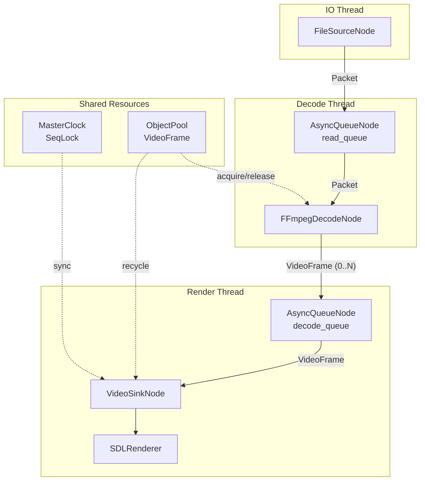
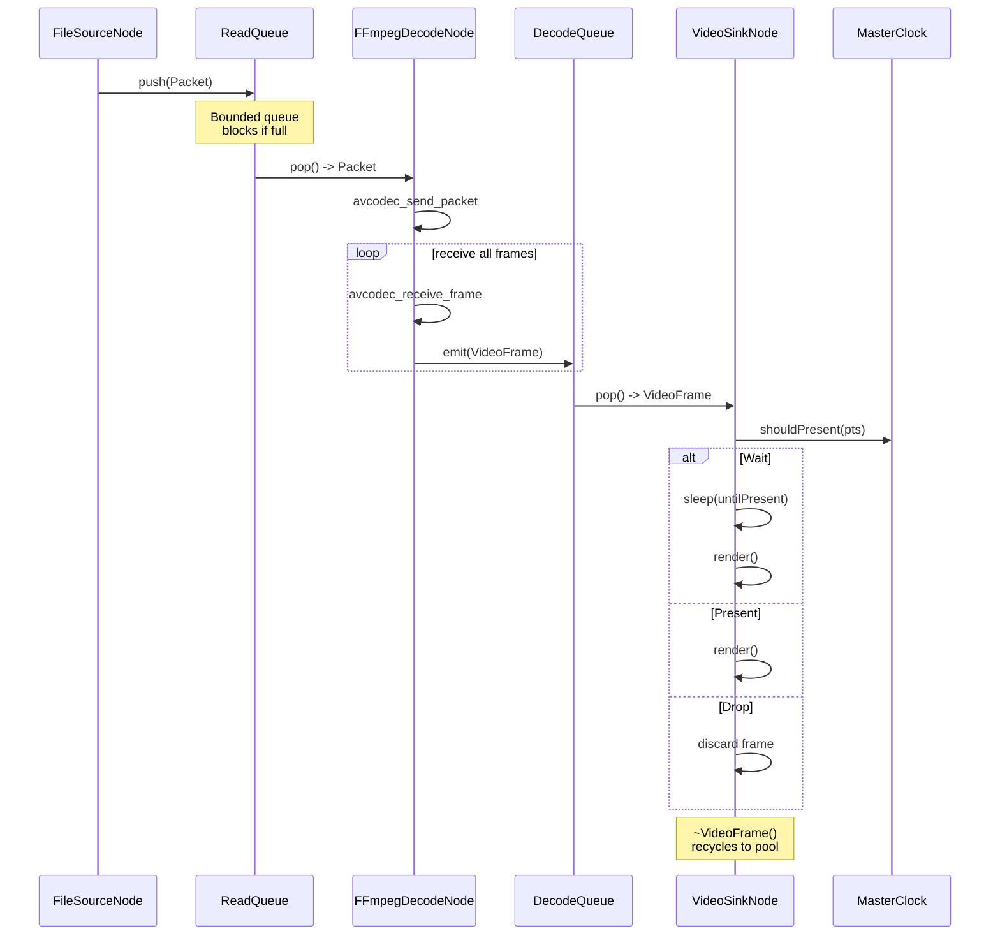
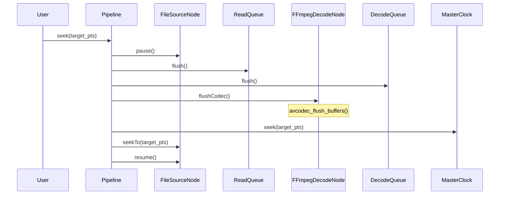
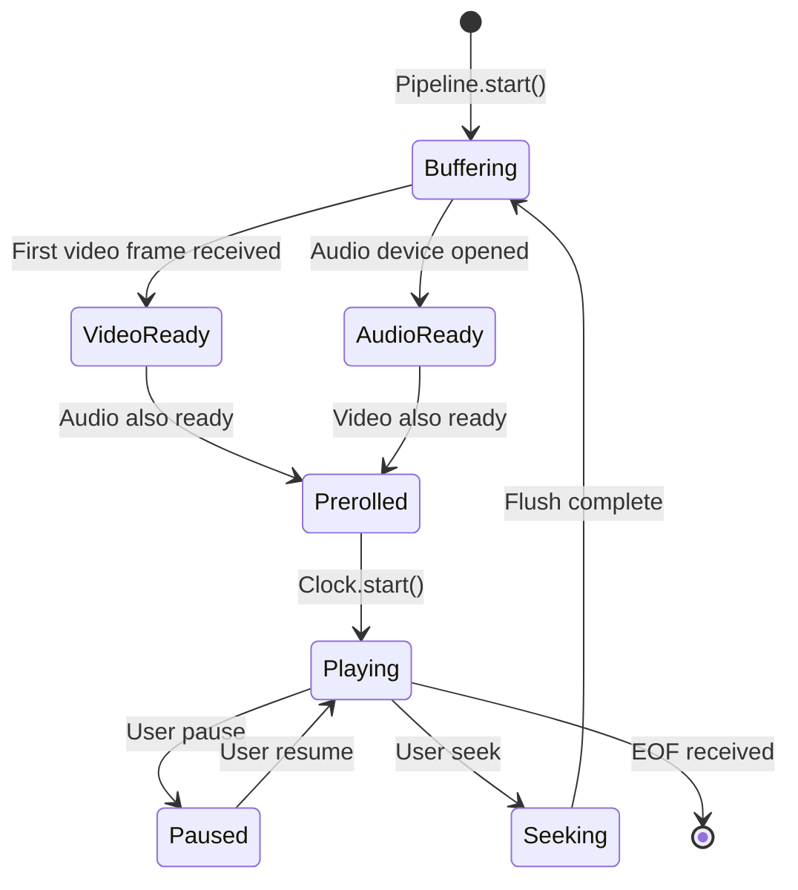
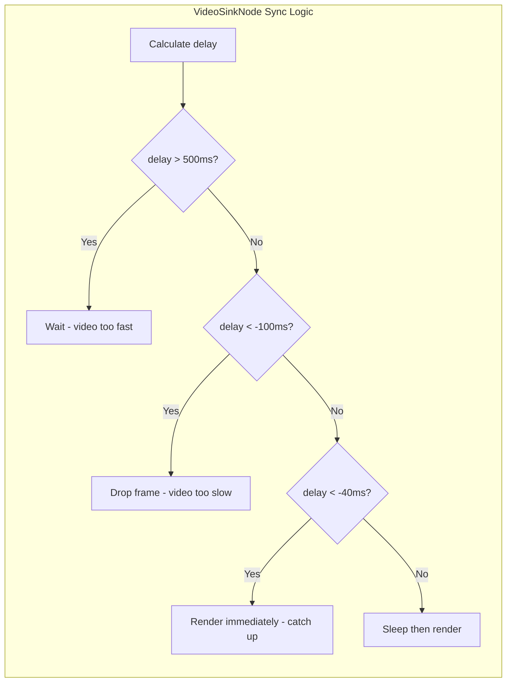
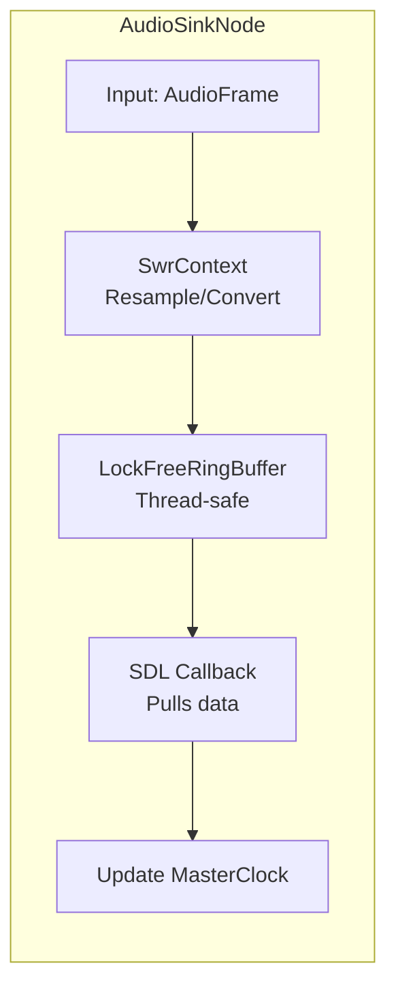
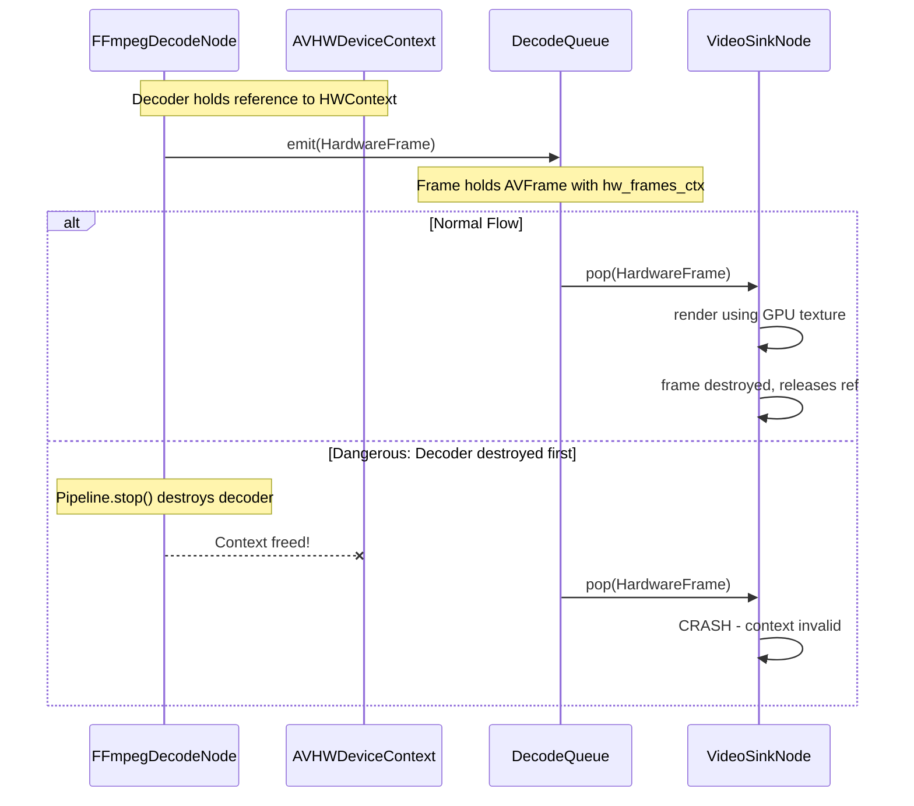
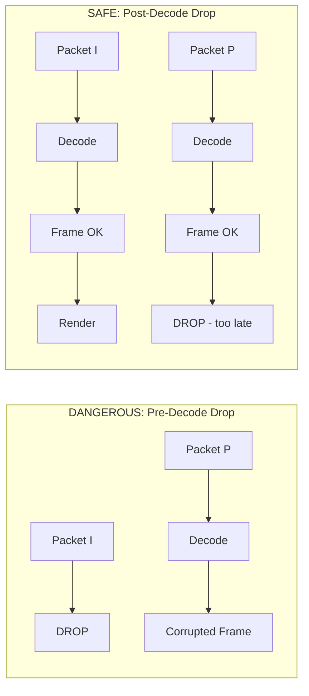

# PhoenixEngine Architecture Design Document

## 1. Project Overview

PhoenixEngine is a modern C++20 video player built on a **Flow Graph architecture**. Key design principles:

- **Node-based Pipeline**: All processing units are nodes connected via typed Pins
- **Zero-copy Data Flow**: `VideoFrame` uses `std::variant` to support both software and hardware frames
- **Thread Isolation**: `AsyncQueueNode` provides thread boundaries, nodes don't manage threads internally
- **Backpressure Control**: Bounded queues prevent memory explosion
- **RAII Everything**: Smart pointers and custom deleters ensure resource safety

---

## 2. Architecture Diagram



---

## 3. Directory Structure

```javascript
PhoenixEngine/
├── CMakeLists.txt              # Build configuration
├── vcpkg.json                  # Dependency manifest
├── src/
│   ├── main.cpp                # Entry point
│   ├── core/                   # Foundation Layer
│   │   ├── types.hpp           # Type aliases, constants
│   │   ├── result.hpp          # Error handling Result<T,E>
│   │   ├── media_frame.hpp     # VideoFrame, Packet definitions
│   │   ├── object_pool.hpp     # Thread-safe memory pool
│   │   └── clock.hpp           # A/V sync clock (SeqLock)
│   ├── graph/                  # Flow Graph Layer
│   │   ├── concepts.hpp        # C++20 Concepts
│   │   ├── pin.hpp             # InputPin/OutputPin with backpressure
│   │   ├── node.hpp            # INode, SourceNode, ProcessorNode, SinkNode
│   │   ├── async_queue.hpp     # AsyncQueueNode (thread boundary)
│   │   └── pipeline.hpp        # Pipeline manager with connect() helpers
│   ├── codec/                  # Codec Layer
│   │   └── ffmpeg/
│   │       ├── ff_utils.hpp    # RAII wrappers (AVFramePtr, etc.)
│   │       └── shared_avframe.hpp  # Reference-counted AVFrame
│   ├── nodes/                  # Business Nodes
│   │   ├── source_node.hpp     # FileSourceNode
│   │   ├── decode_node.hpp     # FFmpegDecodeNode (1-to-N)
│   │   └── video_sink_node.hpp # VideoSinkNode (A/V sync)
│   └── render/                 # Rendering Layer
│       ├── renderer.hpp        # IRenderer interface
│       └── sdl_renderer.hpp    # SDL2 implementation
└── tests/
    └── test_pipeline.cpp
```

---

## 4. Core Module Design

### 4.1 Error Handling: `core/result.hpp`

```cpp
template<typename T, typename E = Error>
class Result {
    std::variant<T, E> data_;
public:
    bool ok() const;
    T& value();
    E& error();
    template<typename F> auto map(F&& f);
};
```


### 4.2 VideoFrame: `core/media_frame.hpp`

Key design: RAII destructor automatically recycles to ObjectPool.

```cpp
class VideoFrame {
public:
    Timestamp pts, dts, duration;
    int width, height;
    PixelFormat format;
    
    // Payload: variant of empty | SoftwareFrame | HardwareFrame
    FramePayload payload;
    
    // RAII: destructor calls recycler
    ~VideoFrame() {
        if (recycler_ && !isEof()) {
            recycler_(std::move(*this));
        }
    }
};
```


### 4.3 SharedAVFrame: `codec/ffmpeg/shared_avframe.hpp`

Wraps AVFrame using FFmpeg's internal reference counting (`av_frame_ref`). **Do NOT use std::shared_ptr** - leverage FFmpeg's built-in refcount mechanism.

```cpp
class SharedAVFrame {
    AVFrame* frame_ = nullptr;
    
public:
    // Default constructor: allocates empty frame
    SharedAVFrame() : frame_(av_frame_alloc()) {}
    
    // Destructor: releases frame
    ~SharedAVFrame() {
        if (frame_) av_frame_free(&frame_);
    }
    
    // Copy constructor: uses av_frame_ref (increases refcount, no deep copy)
    SharedAVFrame(const SharedAVFrame& other) : frame_(av_frame_alloc()) {
        if (other.frame_ && frame_) {
            av_frame_ref(frame_, other.frame_);
        }
    }
    
    // Copy assignment
    SharedAVFrame& operator=(const SharedAVFrame& other) {
        if (this != &other) {
            av_frame_unref(frame_);  // Release current
            if (other.frame_) {
                av_frame_ref(frame_, other.frame_);
            }
        }
        return *this;
    }
    
    // Move constructor: transfers ownership
    SharedAVFrame(SharedAVFrame&& other) noexcept 
        : frame_(other.frame_) {
        other.frame_ = nullptr;
    }
    
    // Move assignment
    SharedAVFrame& operator=(SharedAVFrame&& other) noexcept {
        if (this != &other) {
            if (frame_) av_frame_free(&frame_);
            frame_ = other.frame_;
            other.frame_ = nullptr;
        }
        return *this;
    }
    
    // Wrap existing AVFrame (takes reference, not ownership)
    static SharedAVFrame fromRef(AVFrame* src) {
        SharedAVFrame wrapper;
        if (src && wrapper.frame_) {
            av_frame_ref(wrapper.frame_, src);
        }
        return wrapper;
    }
    
    AVFrame* get() const { return frame_; }
    explicit operator bool() const { return frame_ && frame_->data[0]; }
};
```


### 4.4 MasterClock: `core/clock.hpp`

Uses **SeqLock pattern** for lock-free reads in hot paths.

```cpp
class MasterClock {
    // SeqLock: odd sequence = write in progress
    std::atomic<uint64_t> sequence_{0};
    std::atomic<Timestamp> baseMediaTime_{0};
    std::atomic<int64_t> baseRealTime_{0};
    
public:
    void update(Timestamp mediaTime);  // Single writer
    Timestamp now() const;              // Multi-reader, lock-free
    SyncAction shouldPresent(Timestamp pts);
};
```

---

## 5. Graph System Design

### 5.1 Pin with Backpressure: `graph/pin.hpp`

```cpp
template<Transferable T>
class InputPin {
    std::queue<T> queue_;
    size_t capacity_;
    std::mutex mutex_;
    std::condition_variable cv_space_, cv_data_;
    bool stopped_ = false;
    
public:
    // Blocks if queue full (backpressure)
    Result<void> push(T data, std::chrono::milliseconds timeout);
    
    // Blocks if queue empty
    Result<T> pop(std::chrono::milliseconds timeout);
    
    // CRITICAL for seek: discard all pending items
    void flush() {
        std::lock_guard lock(mutex_);
        std::queue<T> empty;
        std::swap(queue_, empty);
    }
    
    // CRITICAL for shutdown: wake up all blocked threads
    void stop() {
        {
            std::lock_guard lock(mutex_);
            stopped_ = true;
        }
        cv_data_.notify_all();
        cv_space_.notify_all();
    }
    
    void reset() {
        std::lock_guard lock(mutex_);
        stopped_ = false;
        std::queue<T> empty;
        std::swap(queue_, empty);
    }
};
```


### 5.2 AsyncQueueNode: `graph/async_queue.hpp`

**Critical requirements**:

1. Destructor MUST call `stop()` to prevent thread join deadlock
2. Must expose `flush()` for seek operations
3. Must wake blocked `push()`/`pop()` on shutdown
```cpp
template<Transferable T>
class AsyncQueueNode : public INode {
public:
    InputPin<T> input;
    OutputPin<T> output;
    
    ~AsyncQueueNode() {
        stop();  // MUST call to prevent deadlock
    }
    
    void stop() override {
        running_ = false;
        input.stop();  // Wake blocked threads
        if (worker_.joinable()) {
            worker_.join();
        }
    }
    
    // For seek operation
    void flush() {
        input.flush();
    }
    
private:
    std::thread worker_;
    std::atomic<bool> running_{false};
};
```


### 5.3 ProcessorNode: `graph/node.hpp`

**Critical fix**: `process()` returns `void`, emits 0..N outputs.

```cpp
template<Transferable TIn, Transferable TOut>
class ProcessorNode : public INode {
public:
    InputPin<TIn> input;
    OutputPin<TOut> output;
    
    // Subclass implements: may call emit() 0, 1, or N times
    virtual void process(TIn data) = 0;
    
    // For seek: reset internal state
    virtual void flush() {}
    
protected:
    Result<void> emit(TOut data) {
        return output.emit(std::move(data));
    }
};
```


### 5.4 FFmpegDecodeNode: 1-to-N Decoding with Proper EOF/Flush

**Critical**: Must handle both EOF draining AND seek flushing.

```cpp
class FFmpegDecodeNode : public ProcessorNode<Packet, VideoFrame> {
public:
void process(Packet pkt) override {
    if (pkt.isEof()) {
            // === EOF: Drain all buffered B-frames ===
            avcodec_send_packet(codecCtx_.get(), nullptr);  // Enter drain mode
            
            while (true) {
                int ret = avcodec_receive_frame(codecCtx_.get(), avframe.get());
                if (ret == AVERROR_EOF) break;  // Fully drained
                if (ret < 0) break;
                
                emitFrame(avframe.get());  // Emit buffered frames
                av_frame_unref(avframe.get());
            }
            
            emit(VideoFrame::eof());  // NOW send EOF downstream
        return;
    }
    
        avcodec_send_packet(codecCtx_.get(), &avpkt);
    
        // Loop: receive ALL available frames (1-to-N)
    while (true) {
            int ret = avcodec_receive_frame(codecCtx_.get(), avframe.get());
        if (ret == AVERROR(EAGAIN) || ret == AVERROR_EOF) break;
            if (ret < 0) break;
            
            emitFrame(avframe.get());
            av_frame_unref(avframe.get());
        }
    }
    
    // === For Seek: Reset decoder state ===
    void flush() override {
        avcodec_flush_buffers(codecCtx_.get());
    }
};
```


### 5.5 Pipeline Lifecycle: `graph/pipeline.hpp`

```cpp
class Pipeline {
public:
    // Type-safe connection helpers
    template<Transferable T>
    void connect(SourceNode<T>* src, AsyncQueueNode<T>* queue);
    
    template<Transferable TIn, Transferable TOut>
    void connect(AsyncQueueNode<TIn>* queue, ProcessorNode<TIn, TOut>* proc);
    
    // Lifecycle: start downstream first, stop upstream first
    void start() {
        for (auto it = nodes_.rbegin(); it != nodes_.rend(); ++it)
            (*it)->start();
    }
    
    void stop() {
        // 1. Stop all InputPins first (break blocking waits)
        for (auto& node : nodes_) stopInputPins(node.get());
        // 2. Stop nodes in order (source first)
        for (auto* node : nodeOrder_) node->stop();
    }
};
```

---

## 6. Data Flow Diagram



---

## 7. Build Configuration

### vcpkg.json

```json
{
  "name": "phoenix-engine",
  "version": "0.1.0",
  "dependencies": [
    { "name": "ffmpeg", "features": ["avcodec", "avformat", "swscale", "swresample"] },
    "sdl2",
    "spdlog",
    "fmt"
  ]
}
```


### CMakeLists.txt (Key Sections)

```cmake
cmake_minimum_required(VERSION 3.21)
project(PhoenixEngine LANGUAGES CXX)

set(CMAKE_CXX_STANDARD 20)
set(CMAKE_CXX_STANDARD_REQUIRED ON)

# FFmpeg via pkg-config
find_package(PkgConfig REQUIRED)
pkg_check_modules(LIBAV REQUIRED IMPORTED_TARGET
    libavcodec libavformat libavutil libswscale libswresample)

find_package(SDL2 CONFIG REQUIRED)
find_package(spdlog CONFIG REQUIRED)

add_executable(PhoenixEngine ${SOURCES})
target_link_libraries(PhoenixEngine PRIVATE
    PkgConfig::LIBAV
    SDL2::SDL2
    spdlog::spdlog
)
```

---

## 8. Critical State Management (The "Hidden Traps")

Flow Graph architecture's biggest challenge is **state transitions**. Three critical scenarios must be handled correctly:

### 8.1 Seek Flush Mechanism

**Problem**: When seeking from 10:00 to 05:00, ReadQueue and DecodeQueue still contain stale data (10:01, 10:02...). If Source jumps directly, decoder/renderer will output old frames first, causing glitches.**Solution**: Implement `Pipeline::flush()` with coordinated reset:



**Required Interfaces**:

```cpp
// AsyncQueueNode must expose:
void flush() {
    std::lock_guard lock(mutex_);
    std::queue<T> empty;
    std::swap(queue_, empty);
    // Do NOT notify - we're resetting, not producing
}

// FFmpegDecodeNode must expose:
void flushCodec() {
    avcodec_flush_buffers(codecCtx_.get());
}

// Pipeline orchestrates:
void seek(Timestamp target) {
    source_->pause();
    for (auto* queue : asyncQueues_) queue->flush();
    decoder_->flushCodec();
    clock_->seek(target);
    source_->seekTo(target);
    source_->resume();
}
```


### 8.2 EOF Propagation Chain (Graceful Exit)

**Problem**: Video uses B-frame reordering. When EOF packet arrives, decoder still holds buffered frames internally. If we emit EOF immediately, **last few frames are lost**.**Solution**: Proper draining mode before EOF emission:

```cpp
void FFmpegDecodeNode::process(Packet pkt) {
    if (pkt.isEof()) {
        // Step 1: Enter draining mode (send NULL packet)
        avcodec_send_packet(codecCtx_.get(), nullptr);
        
        // Step 2: Drain ALL remaining frames
        auto avframe = makeAVFrame();
        while (true) {
            int ret = avcodec_receive_frame(codecCtx_.get(), avframe.get());
            if (ret == AVERROR_EOF) break;  // Decoder fully drained
            if (ret < 0) break;              // Error, stop draining
            
            emitFrame(avframe.get());        // Emit buffered frame
            av_frame_unref(avframe.get());
        }
        
        // Step 3: Only NOW emit EOF to downstream
        emit(VideoFrame::eof());
        return;
    }
    
    // Normal processing...
}
```

**EOF Chain**:

```javascript
FileSource -> Packet::eof() 
    -> FFmpegDecodeNode receives EOF
        -> avcodec_send_packet(NULL)  // Enter drain mode
        -> loop avcodec_receive_frame  // Get all buffered frames
        -> emit remaining VideoFrames
        -> emit VideoFrame::eof()
    -> VideoSinkNode receives EOF
        -> Graceful shutdown
```


### 8.3 Audio-Video Startup Sync (Pre-roll)

**Problem**: If video thread starts before audio device is ready, clock hasn't started. Video sees `pts > now()`, waits forever, causing initial black screen.**Solution**: Implement Pre-roll state machine:



**Implementation**:

```cpp
enum class PipelineState {
    Stopped,
    Buffering,    // Waiting for both A/V to be ready
    Prerolled,    // Both ready, waiting to start
    Playing,
    Paused,
    Seeking
};

class Pipeline {
    std::atomic<PipelineState> state_{PipelineState::Stopped};
    std::atomic<bool> videoReady_{false};
    std::atomic<bool> audioReady_{false};
    
public:
    void notifyVideoReady() {
        videoReady_ = true;
        checkPrerollComplete();
    }
    
    void notifyAudioReady() {
        audioReady_ = true;
        checkPrerollComplete();
    }
    
private:
    void checkPrerollComplete() {
        if (videoReady_ && audioReady_ && state_ == PipelineState::Buffering) {
            state_ = PipelineState::Prerolled;
            clock_->start();  // NOW the clock begins
            state_ = PipelineState::Playing;
        }
    }
};

// VideoSinkNode behavior during buffering:
void VideoSinkNode::consume(VideoFrame frame) {
    if (pipeline_->state() == PipelineState::Buffering) {
        // Hold first frame, notify ready, don't render yet
        firstFrame_ = std::move(frame);
        pipeline_->notifyVideoReady();
        return;
    }
    // Normal sync logic...
}
```

---

## 9. Known Risks and Mitigations

### 9.1 Deadlock Risk Analysis

Flow Graph architecture is prone to deadlocks during Stop/Flush. The risk matrix:| Scenario | Risk | Mitigation ||----------|------|------------|| Stop: downstream waiting pop(), upstream waiting push() | **High** | Stop InputPins FIRST to wake all waiters || Flush while push() holds mutex | **Medium** | Use separate `flush_mutex_` or atomic flag || Exception during flush | **Medium** | RAII lock guards, no manual unlock || Destructor order in complex graphs | **High** | Use "Poison Pill" pattern |**Poison Pill Pattern** - Enhanced stop semantics:

```cpp
template<Transferable T>
class InputPin {
public:
    // Return type distinguishes: data / timeout / terminated
    enum class PopResult { Ok, Timeout, Terminated };
    
    std::pair<PopResult, std::optional<T>> pop(Duration timeout) {
        std::unique_lock lock(mutex_);
        
        if (!cv_data_.wait_for(lock, timeout, [this] {
            return !queue_.empty() || stopped_;
        })) {
            return {PopResult::Timeout, std::nullopt};
        }
        
        if (stopped_ && queue_.empty()) {
            return {PopResult::Terminated, std::nullopt};
        }
        
        T data = std::move(queue_.front());
        queue_.pop();
        cv_space_.notify_one();
        return {PopResult::Ok, std::move(data)};
    }
    
    void stop() {
        {
            std::lock_guard lock(mutex_);
            stopped_ = true;
            // Optional: inject poison pill
            // queue_.push(T::poison()); 
        }
        cv_data_.notify_all();
        cv_space_.notify_all();
    }
};
```


### 9.2 1-to-N Decoding Edge Cases

FFmpeg's decoder behavior is complex:| Input | Possible Output | Handling ||-------|----------------|----------|| 1 Packet (I-frame) | 1 Frame | Normal emit || 1 Packet (B-frame) | 0 Frames (buffered) | Return without emit, NOT an error || 1 Packet | N Frames (rare) | Loop until EAGAIN || NULL Packet (drain) | 0-N Frames then EOF | Loop until AVERROR_EOF |**Critical: Avoid infinite loop**

```cpp
void FFmpegDecodeNode::drainFrames() {
    int maxIterations = 100;  // Safety limit
    int iterations = 0;
    
    while (iterations++ < maxIterations) {
        int ret = avcodec_receive_frame(ctx, frame);
        
        if (ret == AVERROR(EAGAIN)) {
            return;  // Need more input - NORMAL, not error
        }
        if (ret == AVERROR_EOF) {
            return;  // Decoder fully drained
        }
        if (ret < 0) {
            spdlog::error("Decode error: {}", ret);
            return;  // Real error
        }
        
        emitFrame(frame);
        av_frame_unref(frame);
    }
    
    spdlog::warn("Decoder drain hit iteration limit");
}
```


### 9.3 A/V Sync Drift Correction

Simple sleep-based sync will accumulate drift over time. Need adaptive sync:



**Enhanced VideoSinkNode sync logic**:

```cpp
void VideoSinkNode::consume(VideoFrame frame) {
    if (frame.isEof()) {
        handleEof();
        return;
    }
    
    // Handle no-audio case: fallback to wall clock
    if (!clock_->hasAudioSource()) {
        clock_->useWallClock();
    }
    
    auto delay = Duration(frame.pts - clock_->now());
    auto delayMs = std::chrono::duration_cast<std::chrono::milliseconds>(delay).count();
    
    if (delayMs > 500) {
        // Video WAY too fast - wait
        std::this_thread::sleep_for(std::chrono::milliseconds(delayMs - 10));
        renderFrame(frame);
    } else if (delayMs < -100) {
        // Video severely late (>100ms behind) - DROP
        droppedFrames_++;
        return;  // Don't render
    } else if (delayMs < -40) {
        // Video slightly late - render immediately, no sleep
        renderFrame(frame);
    } else if (delayMs > 0) {
        // Normal case - sleep until presentation time
        std::this_thread::sleep_for(delay);
        renderFrame(frame);
    } else {
        // Within tolerance - render now
        renderFrame(frame);
    }
}
```

**MasterClock fallback for no-audio scenarios**:

```cpp
class MasterClock {
    std::atomic<bool> hasAudioSource_{false};
    std::atomic<bool> useWallClock_{false};
    
public:
    void setAudioSource(bool has) { hasAudioSource_ = has; }
    bool hasAudioSource() const { return hasAudioSource_; }
    
    void useWallClock() {
        if (!useWallClock_.exchange(true)) {
            // First call: initialize wall clock base
            update(0);
        }
    }
    
    Timestamp now() const {
        if (useWallClock_) {
            // Use system time directly
            auto elapsed = Clock::now() - startTime_;
            return std::chrono::duration_cast<Duration>(elapsed).count();
        }
        // Normal SeqLock read...
    }
};
```


### 9.4 Seek Atomicity and Frame Flickering

**Critical Issue**: During seek, residual frames from old timeline can leak through.

```javascript
Timeline: Playing at 05:00 -> User seeks to 10:00

Problem sequence:
1. Pipeline issues Seek command
2. Decoder just produced frame at 05:01, pushes to DecodeQueue
3. Flush executes, but 05:01 frame already in queue
4. Source jumps to 10:00
5. VideoSink renders: 05:01 (flicker!) -> 10:00

Result: Visual glitch - frame from old timeline appears briefly
```

**Solution: Serial Number Mechanism**

```cpp
class Pipeline {
    std::atomic<uint64_t> seekSerial_{0};
    
public:
    void seek(Timestamp target) {
        uint64_t newSerial = ++seekSerial_;  // Increment FIRST
        
        source_->pause();
        flushAllQueues();
        decoder_->flushCodec();
        clock_->seek(target);
        
        // Source will tag all new packets with newSerial
        source_->setSerial(newSerial);
        source_->seekTo(target);
        source_->resume();
    }
    
    uint64_t currentSerial() const { return seekSerial_.load(); }
};

// Packet carries serial
struct Packet {
    uint64_t serial = 0;  // Which "era" this packet belongs to
    // ... other fields
};

// Frame inherits serial from packet
struct VideoFrame {
    uint64_t serial = 0;  // Inherited from source packet
    // ... other fields
};

// VideoSink filters stale frames
void VideoSinkNode::consume(VideoFrame frame) {
    if (frame.serial != pipeline_->currentSerial()) {
        // Stale frame from previous seek era - DROP silently
        return;
    }
    // Normal processing...
}
```

**Benefits**:

- Guarantees zero visual glitches during seek
- Works even if flush timing is imperfect
- Enables "freeze last frame" or "black screen" seek styles

### 9.5 Audio Resampling and Ring Buffer

**Problem**: Audio is often the bottleneck. FFmpeg output format rarely matches SDL device format.| FFmpeg Output | SDL Device | Mismatch ||---------------|------------|----------|| float planar (fltp) | s16 packed | Format + Layout || 48000 Hz | 44100 Hz | Sample rate || Variable samples/frame | Fixed callback size | Buffer timing |**Solution: AudioSinkNode Architecture**




```cpp
class AudioSinkNode : public SinkNode<AudioFrame> {
    SwrContext* swr_ = nullptr;
    LockFreeRingBuffer<uint8_t> ringBuffer_{65536};  // ~1.5 sec at 44.1kHz stereo s16
    
public:
    void consume(AudioFrame frame) override {
        // 1. Resample to device format
        uint8_t* outBuffer = nullptr;
        int outSamples = swr_convert(swr_, &outBuffer, maxSamples,
            frame.data(), frame.sampleCount());
        
        // 2. Push to ring buffer (may block if full - backpressure)
        ringBuffer_.write(outBuffer, outSamples * bytesPerSample_);
    }
    
    // Called from SDL audio thread
    static void sdlCallback(void* userdata, uint8_t* stream, int len) {
        auto* self = static_cast<AudioSinkNode*>(userdata);
        
        int read = self->ringBuffer_.read(stream, len);
        if (read < len) {
            // Underrun - fill with silence
            memset(stream + read, 0, len - read);
        }
        
        // 3. Drive the master clock from audio callback
        int samples = len / self->bytesPerSample_;
        Timestamp elapsed = samples * 1000000 / self->sampleRate_;
        self->clock_->update(self->clock_->now() + elapsed);
    }
};
```


### 9.6 TimeBase Conversion Hell

**Problem**: Different components use different time units.| Component | Time Unit | Example ||-----------|-----------|---------|| AVPacket | stream->time_base (e.g., 1/90000) | pts=450000 = 5 sec || AVFrame | may differ after filters | || SDL | milliseconds | || MasterClock | ??? | |**Risk**: Floating-point precision loss causes A/V drift after hours of playback.**Solution: Unified Microsecond Integer**

```cpp
// In types.hpp - ALL internal timestamps are microseconds
using Timestamp = int64_t;  // Microseconds since start
constexpr Timestamp kTimeBaseUs = 1'000'000;

// Conversion at SOURCE boundary only
Timestamp convertPts(int64_t pts, AVRational timeBase) {
    // Use av_rescale_q for precision
    return av_rescale_q(pts, timeBase, AVRational{1, 1000000});
}

// In FileSourceNode - convert immediately
void FileSourceNode::readLoop() {
    AVPacket* pkt = ...;
    
    Packet packet;
    packet.pts = convertPts(pkt->pts, stream_->time_base);
    packet.dts = convertPts(pkt->dts, stream_->time_base);
    packet.duration = convertPts(pkt->duration, stream_->time_base);
    
    // From here on, everything is microseconds
    output.emit(std::move(packet));
}

// MasterClock - all in microseconds
class MasterClock {
    // now() returns microseconds
    // update() takes microseconds
    // untilPresent() returns std::chrono::microseconds
};
```

**Rules**:

1. Convert to microseconds at input boundary (SourceNode)
2. Use `int64_t` everywhere internally (no floating point for timestamps)
3. Use `av_rescale_q` for precision (handles overflow correctly)
4. Only convert to other units at output boundary (SDL, display)

### 9.7 Hardware Decode Context Lifetime

**Critical Issue**: Hardware frames (D3D11, VAAPI, CUDA) are tied to device context. If decoder is destroyed while sink still holds frames, crash occurs.



**Solution: Reference-counted HW Context**:

```cpp
class HardwareContext {
    AVBufferRef* hwDeviceCtx_ = nullptr;
    std::atomic<int> refCount_{1};
    
public:
    static std::shared_ptr<HardwareContext> create(AVHWDeviceType type) {
        auto ctx = std::make_shared<HardwareContext>();
        av_hwdevice_ctx_create(&ctx->hwDeviceCtx_, type, nullptr, nullptr, 0);
        return ctx;
    }
    
    ~HardwareContext() {
        av_buffer_unref(&hwDeviceCtx_);
    }
    
    AVBufferRef* get() const { return hwDeviceCtx_; }
};

// VideoFrame holds shared_ptr to context
struct HardwareFrame {
    SharedAVFrame avFrame;
    std::shared_ptr<HardwareContext> context;  // Prevents context destruction
};
```

**Pipeline destruction order**:

```cpp
void Pipeline::stop() {
    // 1. Stop source first (stop producing)
    source_->stop();
    
    // 2. Drain queues (process remaining frames)
    for (auto* queue : queues_) {
        queue->drain();  // Wait for empty, with timeout
    }
    
    // 3. Stop sinks (no more frames to render)
    for (auto* sink : sinks_) {
        sink->stop();
    }
    
    // 4. NOW safe to destroy decoder (all frames consumed)
    decoder_->stop();
}
```

---

## 10. Expert Implementation Recommendations

### 10.1 Renderer Hardware/Software Abstraction

SDL2 cannot directly render hardware frames. Need abstraction layer:

```cpp
class IFrameUploader {
public:
    virtual ~IFrameUploader() = default;
    
    // Returns texture handle (SDL_Texture*, VkImage, etc.)
    virtual void* upload(const VideoFrame& frame) = 0;
};

// Software path: upload YUV to texture
class SoftwareUploader : public IFrameUploader {
    SDL_Texture* texture_ = nullptr;
public:
    void* upload(const VideoFrame& frame) override {
        auto& sw = frame.asSoftware();
        SDL_UpdateYUVTexture(texture_, nullptr,
            sw.data(0), sw.linesize(0),
            sw.data(1), sw.linesize(1),
            sw.data(2), sw.linesize(2));
        return texture_;
    }
};

// Hardware path: D3D11 texture sharing (zero-copy)
class D3D11Uploader : public IFrameUploader {
public:
    void* upload(const VideoFrame& frame) override {
        auto* hwFrame = frame.asHardware();
        // Direct texture access - no copy!
        return hwFrame->nativeHandle();  // ID3D11Texture2D*
    }
};

// Renderer uses uploader
class SDLRenderer : public IRenderer {
    std::unique_ptr<IFrameUploader> uploader_;
    
public:
    Result<void> draw(const VideoFrame& frame) override {
        void* texture = uploader_->upload(frame);
        SDL_RenderCopy(renderer_, static_cast<SDL_Texture*>(texture), ...);
        return {};
    }
};
```


### 10.2 Dynamic Graph Reconfiguration

For audio track switching, subtitle changes, resolution changes:

```cpp
class PipelineBuilder {
public:
    // Runtime graph modification
    void switchAudioTrack(int trackIndex) {
        pipeline_.pause();
        pipeline_.flush();
        
        // Disconnect old audio decoder
        audioQueue_->disconnect();
        oldAudioDecoder_.reset();
        
        // Create new audio decoder for track
        auto newDecoder = createAudioDecoder(trackIndex);
        pipeline_.connect(demuxer_, newDecoder.get());
        pipeline_.connect(newDecoder.get(), audioQueue_);
        
        audioDecoder_ = std::move(newDecoder);
        pipeline_.resume();
    }
    
    void enableSubtitles(int trackIndex) {
        pipeline_.pause();
        
        // Add subtitle decoder node to graph
        auto subDecoder = createSubtitleDecoder(trackIndex);
        auto subRenderer = createSubtitleRenderer();
        
        pipeline_.addNode(std::move(subDecoder));
        pipeline_.addNode(std::move(subRenderer));
        pipeline_.connect(demuxer_, subDecoder.get());
        pipeline_.connect(subDecoder.get(), subRenderer.get());
        
        pipeline_.resume();
    }
};
```


### 10.3 Graceful Degradation Strategy

When hardware decode fails, fallback to software:

```cpp
class AdaptiveDecodeNode : public ProcessorNode<Packet, VideoFrame> {
    std::unique_ptr<FFmpegDecodeNode> hwDecoder_;
    std::unique_ptr<FFmpegDecodeNode> swDecoder_;
    bool hwFailed_ = false;
    
public:
    void process(Packet pkt) override {
        if (!hwFailed_ && hwDecoder_) {
            try {
                hwDecoder_->process(std::move(pkt));
                return;
            } catch (const HardwareDecodeError& e) {
                spdlog::warn("HW decode failed, falling back to SW: {}", e.what());
                hwFailed_ = true;
                hwDecoder_.reset();
                
                // Re-initialize software decoder
                initSoftwareDecoder();
            }
        }
        
        swDecoder_->process(std::move(pkt));
    }
};
```


### 10.4 Pre-roll Timeout Mechanism

**Problem**: Strict Pre-roll can deadlock if audio stream is corrupted or missing.

```javascript
Scenario: Video ready, but audio stream has errors
Result: Pipeline waits forever for audioReady_, user sees black screen
```

**Solution: Pre-roll with timeout**

```cpp
class Pipeline {
    static constexpr auto kPrerollTimeout = std::chrono::milliseconds(500);
    
    void checkPrerollComplete() {
        if (state_ != PipelineState::Buffering) return;
        
        auto elapsed = Clock::now() - bufferingStartTime_;
        
        if (videoReady_ && audioReady_) {
            // Both ready - normal start
            startPlayback();
        } else if (videoReady_ && elapsed > kPrerollTimeout) {
            // Video ready but audio timed out - start anyway
            spdlog::warn("Audio pre-roll timeout, starting with wall clock");
            clock_->useWallClock();
            clock_->setAudioSource(false);
            startPlayback();
        }
        // If only audio ready, keep waiting (video is essential)
    }
    
    void startPlayback() {
        state_ = PipelineState::Playing;
        clock_->start();
    }
};
```


### 10.5 Error Recovery Strategy

**Problem**: Corrupted packets should not crash the entire pipeline.

```cpp
class FFmpegDecodeNode : public ProcessorNode<Packet, VideoFrame> {
    int consecutiveErrors_ = 0;
    static constexpr int kMaxConsecutiveErrors = 10;
    
public:
    void process(Packet pkt) override {
        if (pkt.isEof()) {
            handleEof();
            return;
        }
        
        int ret = avcodec_send_packet(codecCtx_.get(), &avpkt);
        
        if (ret < 0 && ret != AVERROR(EAGAIN)) {
            consecutiveErrors_++;
            
            if (consecutiveErrors_ >= kMaxConsecutiveErrors) {
                // Too many errors - report to pipeline
                spdlog::error("Decoder failed {} consecutive times, stopping", 
                    consecutiveErrors_);
                emit(VideoFrame::error(ErrorCode::DecoderError));
                return;
            }
            
            // Single error - warn and skip this packet
            spdlog::warn("Decode error ({}), skipping packet. Consecutive: {}", 
                ret, consecutiveErrors_);
            return;  // Continue with next packet
        }
        
        // Success - reset error counter
        consecutiveErrors_ = 0;
        drainFrames();
    }
};
```


### 10.6 Implementation Pitfalls Guide

Critical details that can break a perfect design:

#### 10.6.1 Audio RingBuffer Size vs Latency Trade-off

| Buffer Size | Latency | Risk ||-------------|---------|------|| 65536 bytes (~1.5s) | High | Slow seek response, hear 1.5s of old audio || 8192 bytes (~200ms) | Low | CPU jitter causes underrun (crackling) || **16384-24576 bytes (400-600ms)** | **Balanced** | **Recommended sweet spot** |

```cpp
class AudioSinkNode {
    // Recommended: 400-600ms buffer, not 1.5s
    static constexpr size_t kBufferSize = 20000;  // ~450ms at 44.1kHz stereo s16
    
    LockFreeRingBuffer<uint8_t> ringBuffer_{kBufferSize};
    
    void onSeek() {
        // CRITICAL: Must clear ring buffer on seek!
        ringBuffer_.clear();
    }
};
```


#### 10.6.2 SDL Callback Thread Safety

**Critical**: `sdlCallback` runs on SDL's audio thread, NOT your render thread.

```cpp
static void sdlCallback(void* userdata, uint8_t* stream, int len) {
    auto* self = static_cast<AudioSinkNode*>(userdata);
    
    // These operations MUST be thread-safe:
    // 1. ringBuffer_.read() - must be lock-free
    // 2. clock_->update() - uses SeqLock, OK
    // 3. pipeline_->state() - must be atomic
    
    // SeqLock is PERFECT for this - writer is fast, reader retries if needed
}
```


#### 10.6.3 Pause Logic Trap

**Problem**: Audio callback continues during pause (outputs silence). If clock keeps updating, video will fast-forward on resume.

```cpp
static void sdlCallback(void* userdata, uint8_t* stream, int len) {
    auto* self = static_cast<AudioSinkNode*>(userdata);
    
    if (self->pipeline_->state() == PipelineState::Paused) {
        // Fill with silence
        memset(stream, 0, len);
        // CRITICAL: Do NOT update clock!
        return;
    }
    
    int read = self->ringBuffer_.read(stream, len);
    if (read < len) {
        memset(stream + read, 0, len - read);  // Underrun - silence
    }
    
    // Only update clock when actually playing audio
    int samples = read / self->bytesPerSample_;
    self->clock_->update(self->lastPts_ + samples * 1000000 / self->sampleRate_);
}
```


#### 10.6.4 Frame Drop Safety

**Key insight**: WHERE you drop frames matters!| Drop Location | Safety | Effect ||---------------|--------|--------|| Before Decoder (packet level) | **DANGEROUS** | Dropping I-frame causes corruption || After Decoder (frame level) | **SAFE** | Already decoded, just skip render |



**Current architecture is SAFE**: Decoder processes all packets, Sink drops late frames.

```cpp
void VideoSinkNode::consume(VideoFrame frame) {
    auto delay = frame.pts - clock_->now();
    
    if (delay < -100000) {  // 100ms late
        // SAFE to drop - frame is already fully decoded
        // Decoder saw all reference frames, no corruption risk
        droppedFrames_++;
        return;
    }
    
    renderFrame(frame);
}
```

**If implementing packet-level drop for performance** (advanced):

```cpp
void PacketFilterNode::process(Packet pkt) {
    if (shouldDrop(pkt)) {
        // ONLY drop if:
        // 1. It's NOT a keyframe (I-frame)
        // 2. We're not in "recovery mode" after a drop
        if (pkt.keyFrame) {
            // NEVER drop keyframes!
            emit(std::move(pkt));
            inRecovery_ = false;
        } else if (!inRecovery_) {
            // Safe to drop P/B frame
            droppedPackets_++;
            inRecovery_ = true;  // Wait for next keyframe
        }
    } else {
        emit(std::move(pkt));
    }
}
```

---

### 10.7 Memory Pool Strategy (Current vs Future)

**Current Approach (Recommended)**:

- Recycle `VideoFrame` objects via `ObjectPool`
- Let FFmpeg manage `AVFrame` buffer memory internally via `av_frame_ref`
- This is the **best cost-benefit ratio**

**Future Optimization (High Complexity)**:

```cpp
// Custom AVBuffer allocator - NOT recommended for initial implementation
AVBufferRef* customAlloc(void* opaque, size_t size) {
    auto* pool = static_cast<MemoryPool*>(opaque);
    void* data = pool->allocate(size);
    return av_buffer_create(data, size, customFree, opaque, 0);
}

// Register with codec context
codecCtx_->get_buffer2 = customGetBuffer2;
```

**Conclusion**: Start with current approach. Only consider custom allocator if profiling shows memory allocation as bottleneck (unlikely for most use cases).---

## 11. Implementation Priority and Phases

### Phase 1: Minimal Viable Player (MVP)

Focus: Get video playing end-to-end| Task | Priority | Notes ||------|----------|-------|| Core types + Result | P0 | Foundation || Graph system (Pin, Node, AsyncQueue) | P0 | Architecture backbone || FileSourceNode (video only) | P0 | No audio initially || FFmpegDecodeNode (software) | P0 | Hardware later || SDLRenderer (software upload) | P0 | Simple YUV texture || MasterClock (wall clock mode) | P0 | No audio sync yet || main.cpp basic pipeline | P0 | Just play video |

### Phase 2: Audio Integration

Focus: Add audio and proper A/V sync| Task | Priority | Notes ||------|----------|-------|| AudioFrame + AudioSinkNode | P1 | With SwrContext || LockFreeRingBuffer | P1 | Audio buffering || MasterClock audio-driven | P1 | Proper sync || Multi-stream demux | P1 | Audio + Video |

### Phase 3: User Controls

Focus: Seek, pause, and robustness| Task | Priority | Notes ||------|----------|-------|| Serial Number mechanism | P2 | Seek atomicity || Pipeline seek/pause/resume | P2 | User control || Pre-roll with timeout | P2 | Startup sync || Error recovery | P2 | Robustness |

### Phase 4: Hardware Acceleration

Focus: Performance| Task | Priority | Notes ||------|----------|-------|| HardwareContext | P3 | Context lifetime || D3D11/CUDA decoder | P3 | Platform specific || IFrameUploader | P3 | Zero-copy render || AdaptiveDecodeNode | P3 | Fallback logic |---

## 12. Key Design Decisions Summary

| Issue | Solution ||-------|----------|| 1-to-N decoding | `process()` returns void, loop `avcodec_receive_frame` + `emit()` || AVFrame lifetime | `SharedAVFrame` with copy ctor using `av_frame_ref`, NO std::shared_ptr || Backpressure | `InputPin` has bounded queue with `flush()`, blocks producer when full || Clock contention | SeqLock pattern: atomic sequence + retry on odd || Pipeline deadlock | Stop InputPins first, Poison Pill pattern, proper destruction order || Connection boilerplate | `Pipeline::connect()` template helpers || **Seek flush** | `Pipeline::seek()` pauses source, flushes queues, calls `avcodec_flush_buffers` || **EOF draining** | On EOF: `avcodec_send_packet(NULL)`, loop receive until `AVERROR_EOF` || **Startup sync** | Pre-roll state machine: wait for both A/V ready before clock starts || **Thread safety** | `AsyncQueueNode` destructor MUST call `stop()` to wake blocked threads || **A/V drift** | Adaptive sync: drop if >100ms late, wait if >500ms early || **HW context** | `HardwareFrame` holds `shared_ptr<HardwareContext>` to prevent use-after-free || **No audio fallback** | `MasterClock::useWallClock()` when no audio source available || **Seek atomicity** | Serial Number mechanism - tag packets/frames, filter stale at sink || **TimeBase precision** | Convert to int64_t microseconds at boundary, use av_rescale_q || **Audio pipeline** | SwrContext + LockFreeRingBuffer + clock driven by SDL callback || **Pre-roll timeout** | 500ms timeout - start with wall clock if audio not ready || **Error recovery** | Skip single bad packet, fail only after 10 consecutive errors || **RingBuffer size** | 400-600ms buffer (not 1.5s) - balance latency vs stability || **SDL callback safety** | Lock-free ringBuffer, SeqLock clock, atomic state check || **Pause audio trap** | Callback fills silence + STOPS clock update during pause || **Frame drop location** | Drop at Sink (post-decode) is SAFE; pre-decode drop is dangerous || **Queue capacity** | Video: 30-50 packets; Audio: 500-1000 packets (different sizes!) || **Multi-output demux** | SourceNode has videoOutput + audioOutput pins for Phase 2 || **FFmpeg version** | Require 5.x+ (libavcodec 59+), use send/receive API only || **Channel Layout** | Use AVChannelLayout struct + swr_alloc_set_opts2 (not uint64_t bitmask) || **AVPacket RAII** | PacketWrapper with move-only semantics, av_packet_free in destructor |---

## 13. Implementation Todos

| ID | Task | Dependencies ||----|------|--------------|| create-structure | Create project directory structure | - || core-types | Implement `types.hpp`, `result.hpp` | create-structure || core-frame | Implement `media_frame.hpp`, `shared_avframe.hpp` (NO shared_ptr!) | core-types || core-pool | Implement `object_pool.hpp` | core-types || core-clock | Implement `clock.hpp` with SeqLock + Pre-roll + wall clock fallback | core-types || graph-pin | Implement `pin.hpp` with backpressure + `flush()` + Poison Pill | core-types || graph-node | Implement `node.hpp` base classes with `flush()` virtual | graph-pin || graph-async | Implement `async_queue.hpp` (destructor calls stop!) | graph-node || graph-pipeline | Implement `pipeline.hpp` with `connect()` + `seek()` + state machine | graph-async || node-source | Implement `FileSourceNode` with `pause()`/`resume()`/`seekTo()` | graph-node, core-frame || node-decode | Implement `FFmpegDecodeNode` with EOF draining + iteration limit | graph-node, core-frame || node-sink | Implement `VideoSinkNode` with adaptive sync + Pre-roll | graph-node, core-clock || render-upload | Implement `IFrameUploader` for HW/SW abstraction | core-frame || render-sdl | Implement `SDLRenderer` with uploader | render-upload || hw-context | Implement `HardwareContext` with reference counting | core-frame || main-entry | Implement `main.cpp` with full pipeline + seek/pause controls | all above |---

## 14. Implementation Constraints for Code Generation

These are **mandatory constraints** to prevent "toy code" issues:

### 14.1 AsyncQueueNode Constraints

```javascript
Implement AsyncQueueNode with a std::queue. Crucially:
1. Add a flush() method that discards all pending items
2. Destructor MUST call stop() which wakes up any blocking pop()/push() calls
3. stop() must set stopped_=true and notify_all on BOTH condition variables
4. pop() should return Result with PopResult enum: Ok/Timeout/Terminated
5. Consider Poison Pill pattern: inject special EOF marker on stop
6. This prevents thread join deadlocks during shutdown
```


### 14.2 FFmpegDecodeNode Constraints

```javascript
In process(), handle EOF packet specifically:
1. When pkt.isEof(), call avcodec_send_packet(ctx, nullptr) to enter draining mode
2. Loop avcodec_receive_frame until AVERROR_EOF (NOT EAGAIN!)
3. Add iteration limit (e.g., 100) to prevent infinite loops
4. Emit ALL remaining buffered frames during this loop
5. Only AFTER the loop completes, emit VideoFrame::eof() to downstream
6. Implement flushCodec() that calls avcodec_flush_buffers() for seek support
7. EAGAIN after send_packet is NORMAL, not an error - just means need more input
```


### 14.3 SharedAVFrame Constraints

```javascript
Implement SharedAVFrame holding a raw AVFrame*:
1. Constructor: call av_frame_alloc()
2. Destructor: call av_frame_free()
3. Copy constructor: use av_frame_ref() (creates new reference, NOT deep copy)
4. Copy assignment: av_frame_unref() current, then av_frame_ref() from source
5. Move constructor: transfer pointer ownership, set source to nullptr
6. Move assignment: free current if needed, transfer ownership
7. Do NOT use std::shared_ptr - leverage FFmpeg's internal refcount
```


### 14.4 InputPin Constraints

```javascript
InputPin must support graceful shutdown:
1. push() and pop() must check stopped_ flag after waking from wait
2. stop() must set stopped_=true and call notify_all on BOTH cv_data_ and cv_space_
3. flush() must clear the queue without notifying (used for seek)
4. reset() must clear queue AND reset stopped_=false (used after seek)
5. pop() should return PopResult enum to distinguish timeout vs termination
```


### 14.5 MasterClock Constraints

```javascript
MasterClock must be lock-free for readers:
1. Use SeqLock pattern: atomic<uint64_t> sequence
2. Writers: increment to odd before write, increment to even after write
3. Readers: loop until reading same even sequence before and after
4. Support Pre-roll: don't start clock until both A/V report ready
5. Implement useWallClock() fallback for no-audio scenarios
6. hasAudioSource() to check if audio is driving the clock
```


### 14.6 Pipeline Constraints

```javascript
Pipeline must handle state transitions:
1. start(): start downstream nodes FIRST, then source (so data has somewhere to go)
2. stop(): stop InputPins first (wake threads), drain queues, then stop nodes
3. Destruction order: stop source -> drain -> stop sinks -> destroy decoder (for HW safety)
4. seek(): pause source -> flush queues -> flushCodec -> reset clock -> seekTo -> resume
5. Implement PipelineState enum: Stopped, Buffering, Prerolled, Playing, Paused, Seeking
```


### 14.7 VideoSinkNode Constraints

```javascript
VideoSinkNode must implement adaptive A/V sync:
1. If delay > 500ms: video too fast, sleep
2. If delay < -100ms: video too late, DROP frame (don't render)
3. If delay < -40ms: slightly late, render immediately without sleep
4. Handle Pre-roll: hold first frame until pipeline signals ready
5. Count dropped/rendered frames for debugging
6. Handle no-audio case: trigger clock.useWallClock()
```


### 14.8 HardwareContext Constraints

```javascript
For hardware decoding safety:
1. HardwareFrame must hold shared_ptr<HardwareContext>
2. HardwareContext wraps AVBufferRef* (hw_device_ctx)
3. This prevents context destruction while frames are still in use
4. Pipeline destruction must drain all frames before destroying decoder
```


### 14.9 Serial Number (Seek Atomicity) Constraints

```javascript
To prevent stale frame flickering during seek:
1. Pipeline maintains atomic<uint64_t> seekSerial_
2. Increment seekSerial_ BEFORE issuing seek command
3. Packet struct must include uint64_t serial field
4. SourceNode tags all packets with current serial
5. VideoFrame inherits serial from its source packet
6. VideoSinkNode: if (frame.serial != pipeline.currentSerial()) DROP
7. This guarantees zero visual glitches even with imperfect flush timing
```


### 14.10 TimeBase Conversion Constraints

```javascript
To prevent A/V drift from floating-point precision loss:
1. ALL internal timestamps use int64_t microseconds
2. Convert at SOURCE boundary using av_rescale_q (handles overflow)
3. NEVER use floating point for timestamp arithmetic internally
4. MasterClock operates entirely in microseconds
5. Only convert to other units at OUTPUT boundary (SDL, display)
6. Example: convertPts(pts, timeBase) = av_rescale_q(pts, timeBase, {1, 1000000})
```


### 14.11 AudioSinkNode Constraints

```javascript
Audio pipeline requirements:
1. Must include SwrContext for format/samplerate conversion
2. Must include LockFreeRingBuffer between decode and SDL callback
3. Ring buffer size: 400-600ms (16384-24576 bytes) - NOT 1.5s!
            - Too large: slow seek response, hear old audio after seek
            - Too small: CPU jitter causes crackling
4. SDL callback DRIVES the MasterClock: clock.update(lastPts + samples/sampleRate)
5. CRITICAL: On seek, must call ringBuffer.clear()
6. Handle underrun: fill with silence, don't crash
7. Handle overrun: block or drop oldest (backpressure)
```


### 14.12 SDL Callback Thread Safety Constraints

```javascript
sdlCallback runs on SDL's audio thread, NOT your render thread:
1. ringBuffer.read() - MUST be lock-free implementation
2. clock_->update() - SeqLock guarantees fast atomic write, OK
3. pipeline_->state() - must be std::atomic<PipelineState>, no mutex
4. NEVER hold mutex in audio callback - causes audio glitches
5. Keep callback as short as possible
```


### 14.13 Pause Logic in Audio Callback Constraints

```javascript
CRITICAL: During pause, audio callback continues but must NOT update clock:
1. Check pipeline state at START of callback (atomic read)
2. If Paused: fill buffer with silence (memset 0)
3. If Paused: DO NOT call clock_->update() - this is the trap!
4. If Playing: normal processing + clock update
5. Violation causes: clock runs during pause -> video fast-forwards on resume
```


### 14.14 Frame Drop Location Constraints

```javascript
WHERE you drop frames determines safety:
1. Post-Decoder drop (VideoSink): ALWAYS SAFE
            - Frame already decoded, all references resolved
            - Just skip rendering, no corruption
2. Pre-Decoder drop (Packet level): DANGEROUS
            - Dropping I-frame corrupts all following P/B frames until next I-frame
            - If implementing packet drop for performance:
     a. NEVER drop keyframes (pkt.flags & AV_PKT_FLAG_KEY)
     b. After dropping, enter "recovery mode" - wait for next keyframe
     c. Only drop P/B frames when NOT in recovery mode
3. Current architecture drops at Sink: SAFE by design
```


### 14.15 Queue Capacity Units (Packets vs Bytes)

```javascript
Different media types need different queue strategies:

VIDEO Queue:
- Packet size: 10KB - 2MB (I-frame can be huge)
- Recommended capacity: 30-50 packets
- Memory: 30 * 500KB = ~15MB worst case

AUDIO Queue:
- Packet size: 100 bytes - 2KB (AAC frame ~400 bytes)
- Count is HUGE: 44100Hz / 1024 samples = 43 packets/second
- Recommended capacity: 500-1000 packets
- Memory: 1000 * 2KB = ~2MB

Implementation:
1. Phase 1 (simple): Just use large capacity for audio queue
   videoQueue = AsyncQueueNode<Packet>("video_queue", 50);
   audioQueue = AsyncQueueNode<Packet>("audio_queue", 1000);

2. Future (advanced): Byte-based limit
   class ByteLimitedQueue {
       size_t maxBytes_ = 10 * 1024 * 1024;  // 10MB
       size_t currentBytes_ = 0;
       // Block when currentBytes_ > maxBytes_
   };

WARNING: If audio queue fills up, it can block demuxer from reading
video packets, causing video starvation. Always size audio queue large.
```


### 14.16 Demuxer Multi-Output Design

```javascript
FileSourceNode must support multiple output streams:

Phase 1 (Video only):
  OutputPin<Packet> videoOutput;

Phase 2 (Audio + Video):
  std::map<MediaType, OutputPin<Packet>*> outputs_;
  // or
  OutputPin<Packet> videoOutput;
  OutputPin<Packet> audioOutput;

Implementation pattern:
class FileSourceNode : public INode {
    OutputPin<Packet> videoOutput;
    OutputPin<Packet> audioOutput;
    
    void readLoop() {
        AVPacket* pkt = ...;
        int streamIdx = pkt->stream_index;
        
        if (streamIdx == videoStreamIdx_) {
            Packet p = convert(pkt);
            p.serial = currentSerial_;
            videoOutput.emit(std::move(p));
        } else if (streamIdx == audioStreamIdx_) {
            Packet p = convert(pkt);
            p.serial = currentSerial_;
            audioOutput.emit(std::move(p));
        }
        // Ignore other streams (subtitles, etc.)
    }
};

Phase 2 pipeline:
  FileSource --videoOutput--> VideoQueue --> VideoDecoder --> ...
            \--audioOutput--> AudioQueue --> AudioDecoder --> ...
```


### 14.17 FFmpeg Version Compatibility

```javascript
CRITICAL: Use FFmpeg 5.x or 6.x (not 4.x or older)

Old API (DEPRECATED, don't use):
  avcodec_decode_video2()
  avcodec_decode_audio4()
  avcodec_encode_video2()

New API (use this):
  avcodec_send_packet() + avcodec_receive_frame()  // Decode
  avcodec_send_frame() + avcodec_receive_packet()  // Encode

vcpkg.json should NOT specify version (gets latest):
{
  "name": "ffmpeg",
  "features": ["avcodec", "avformat", "swscale", "swresample"]
}

Verify version in code:
#if LIBAVCODEC_VERSION_MAJOR < 59
  #error "FFmpeg 5.0+ required (libavcodec 59+)"
#endif

Version mapping:
  FFmpeg 5.0 = libavcodec 59
  FFmpeg 6.0 = libavcodec 60
  FFmpeg 7.0 = libavcodec 61

The send/receive API matches our ProcessorNode::process() design perfectly:
  process(Packet) -> calls send_packet once, receive_frame in loop
```


### 14.18 Channel Layout API (FFmpeg 5.1+)

```javascript
CRITICAL: Old channel_layout (uint64_t bitmask) is DEPRECATED in FFmpeg 5.1+

OLD API (will break in FFmpeg 7.0):
  ctx->channel_layout = AV_CH_LAYOUT_STEREO;  // Deprecated!
  swr_alloc_set_opts(..., channel_layout, ...)  // Deprecated!

NEW API (required):
  AVChannelLayout layout;
  av_channel_layout_default(&layout, 2);  // Stereo
  // or
  av_channel_layout_copy(&dst_layout, &src_layout);

SwrContext initialization (correct way):
  SwrContext* swr = nullptr;
  AVChannelLayout outLayout, inLayout;
  
  av_channel_layout_default(&outLayout, 2);  // Stereo output
  av_channel_layout_copy(&inLayout, &frame->ch_layout);  // From decoder
  
  swr_alloc_set_opts2(&swr,
      &outLayout, AV_SAMPLE_FMT_S16, 44100,   // Output
      &inLayout, frame->format, frame->sample_rate,  // Input
      0, nullptr);
  swr_init(swr);

Cleanup:
  av_channel_layout_uninit(&outLayout);
  av_channel_layout_uninit(&inLayout);
  swr_free(&swr);

If you use old API: compiler will show deprecation warnings,
and FFmpeg 7.0 will fail to compile.
```


### 14.19 AVPacket RAII Wrapper

```javascript
AVPacket also needs RAII (like SharedAVFrame, but simpler - no refcount needed):

class PacketWrapper {
    AVPacket* pkt_ = nullptr;
    
public:
    PacketWrapper() : pkt_(av_packet_alloc()) {}
    
    ~PacketWrapper() {
        if (pkt_) av_packet_free(&pkt_);
    }
    
    // Move only (exclusive ownership)
    PacketWrapper(PacketWrapper&& other) noexcept : pkt_(other.pkt_) {
        other.pkt_ = nullptr;
    }
    
    PacketWrapper& operator=(PacketWrapper&& other) noexcept {
        if (this != &other) {
            if (pkt_) av_packet_free(&pkt_);
            pkt_ = other.pkt_;
            other.pkt_ = nullptr;
        }
        return *this;
    }
    
    // Delete copy (no av_packet_ref needed for our use case)
    PacketWrapper(const PacketWrapper&) = delete;
    PacketWrapper& operator=(const PacketWrapper&) = delete;
    
    // Unref content but keep wrapper
    void unref() { av_packet_unref(pkt_); }
    
    AVPacket* get() const { return pkt_; }
    AVPacket* operator->() const { return pkt_; }
};

Usage in SourceNode:
  void readLoop() {
      PacketWrapper pkt;  // RAII
      
      while (running_) {
          int ret = av_read_frame(formatCtx_, pkt.get());
          if (ret < 0) break;
          
          // Convert to our Packet struct (copies data)
          Packet p;
          p.data.assign(pkt->data, pkt->data + pkt->size);
          p.pts = convertPts(pkt->pts, ...);
          
          output.emit(std::move(p));  // Move semantics
          
          pkt.unref();  // Reuse wrapper for next read
      }
  }  // pkt destructor calls av_packet_free

Our Packet struct (not FFmpeg's):
  struct Packet {
      std::vector<uint8_t> data;  // Owns the data
      Timestamp pts, dts, duration;
      uint64_t serial;
      int streamIndex;
      bool keyFrame;
      
      // Move semantics by default (vector<> is movable)
      // No need for av_packet_ref - we copied the data
  };

Why copy data into Packet?
        - Decouples from FFmpeg internal buffers
        - Simplifies memory management
        - Enables type-safe queuing
        - Cost: one memcpy per packet (acceptable)
```


### 14.12 Pre-roll Timeout Constraints

```javascript
To prevent infinite waiting:
1. Set kPrerollTimeout = 500ms (configurable)
2. If video ready but audio times out: start with wall clock
3. Call clock.useWallClock() and clock.setAudioSource(false)
4. Log warning but don't fail - show video to user
5. Never wait for audio if there's no audio stream
```


### 14.13 Error Recovery Constraints

```javascript
Robust error handling:
1. Track consecutiveErrors_ counter in DecoderNode
2. Single decode error: warn, skip packet, continue
3. Reset counter on successful decode
4. If consecutiveErrors_ >= 10: report fatal error upstream
5. NEVER crash pipeline on single corrupted packet
6. EAGAIN is NOT an error - it means "need more input"


```